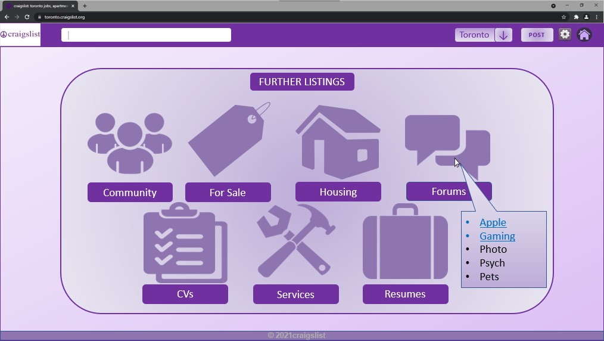

<h1 align="center">Projects</h1>

<h2>

Low-Fidelity Prototype for UX230 Interaction Design

</h2>

    This low-fidelity Prototype was created using PowerPoint, and it was an entry for a re-designing of the infamous 'craigslist' homepage.   
    My aim for this project was to make it less overwhelming for new users to access this website, while finding a way to challenge power users.   
    This in turn led me to create this design since it would incorporate a list when you hover over the icons accessed to stick true to the brand name.  

<h3 align="center">My Angle</h3>

    My main focus was to retain pre-existing users of 'craigslist' while updating the UI to a more modern aesthetic. 
    I chose to handle these elements in a similar manner as mentioned in the article. Firstly, the incentive that I wanted to give to the use in order 
    for them to use the application more was by providing a more manageable layout while using the brand's colours. In order, to give the nostalgia of 
    the old website. I believe by including the list over hovering on each category helps with this. 
    For the motivation aspect I sought to emphasize the search feature more as to make it more noticeable since search bars are very handy in order to quickly convey the users emotions. 
    Futhermore, I decided to round out any rectangular edges to signal affordances, so that the users know that it would be interactable.

    Reference
    Messaki, Erik. “Designing for User Retention That Works.” Medium, UX Planet, 8 Oct. 2021, https://uxplanet.org/designing-for-user-retention-that-works-16793351512a.

---